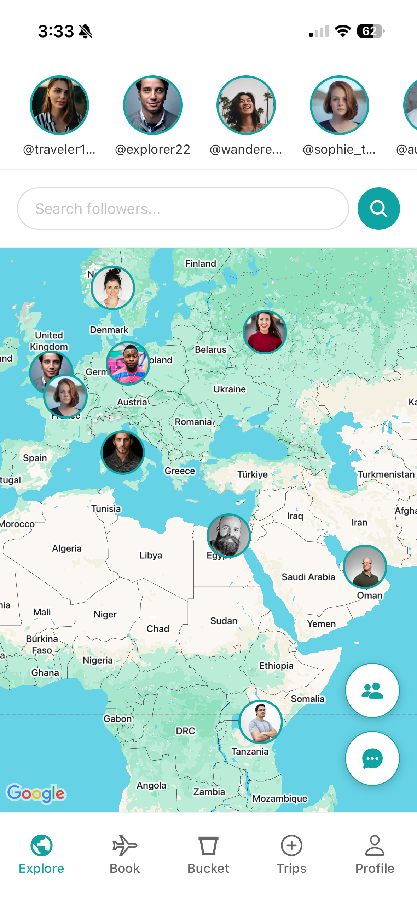
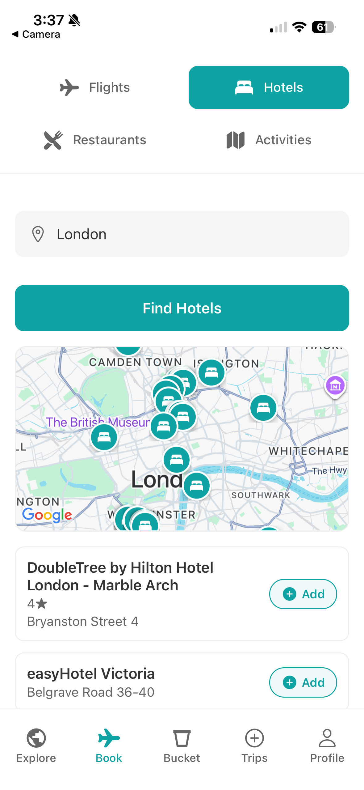
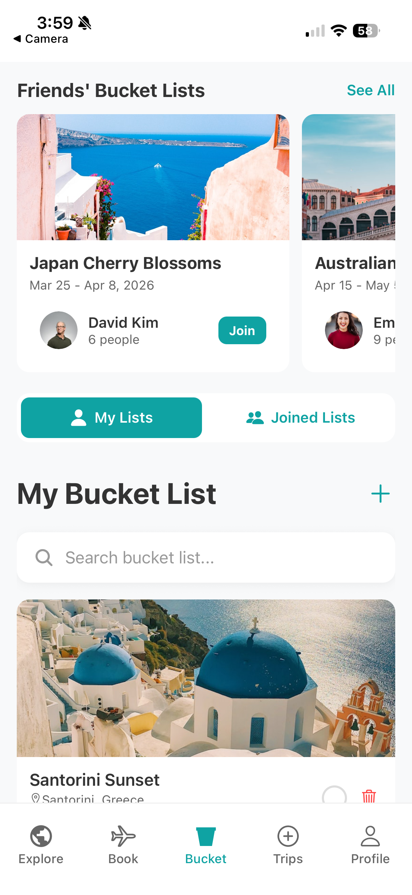
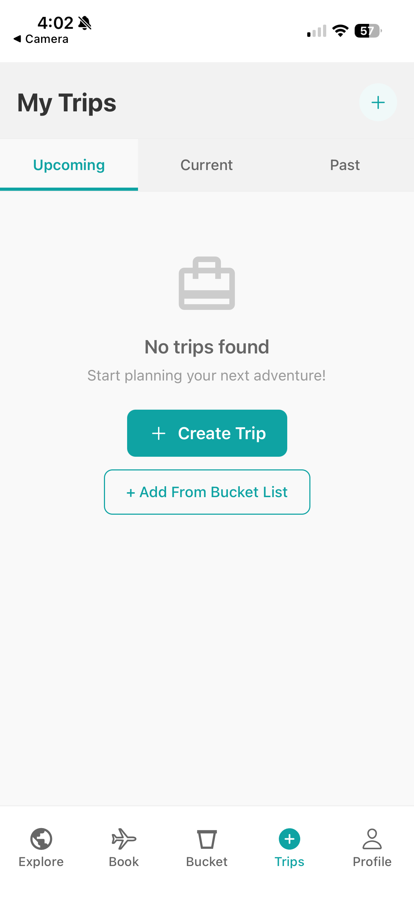
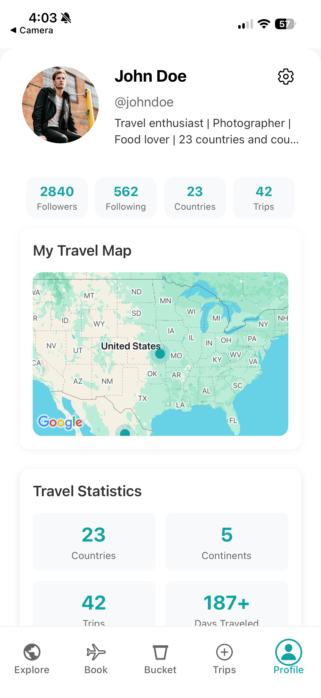

# Trippi

## What is Trippi
Trippi is a modern social travel planning app built with React Native and Expo. Connect with fellow travelers, plan trips, share experiences, and discover new destinations. Right now the app is in development and is not ready for production. It is mostly an idea and a concept that I am working on. I have only been working on the IOS features of the app. I am continuing to build the app and add new features to it daily, so please forgive any bugs or issues that may come up. I have not had time to fully implement all the features that I have planned, but I am working on it! I enjoy building apps in my free time so, I am open to suggestions, advice, and feedback you may have!

## Features

### Explore Map
- Browse trips from travelers worldwide on an interactive map from your friends to influencers
- Switch between your friends trips, your own trips, and featured trips to discover, get inspired, and plan your next trip
- View detailed trip information, including photos, restaurants, hotels, and activities
- Engage with posts through likes and comments to learn more about their trip
- Follow users and send direct messages in order to start to plan your next trip

### Booking
- Book flights, hotels, and activities through our partner travel agencies
- Add your booking to your trip so that you can keep track of your trip, share your booking with your friends, and plan with your friends more easily.

### Bucket List
- Maintain a personal bucket list of dream destinations
- Add notes, locations, and images to each destination in order to plan your next trip
- Join friends' bucket lists and collaborate on travel goals in order to better plan your next trip and make it easier to plan and book your next trip.
- Browse available trips from other travelers in order to get inspired and plan your next trip

### Trip Planning
- Create and manage your trips with detailed itineraries
- Add destinations, dates, and descriptions
- Share trips publicly or keep them private
- Collaborate with friends on trip plans
- Create trips from your bucket list or from other peoples trips

### Social Feed
- Like, comment, and save posts
- Follow other travelers
- Engage with a community of travel enthusiasts

### 💬 Direct Messaging
- Chat with other travelers
- Plan trips together
- Share recommendations and tips

### 👤 User Profiles
- View travel statistics (countries visited, trips taken, etc.)
- Interactive travel map showing visited locations
- Display recent trips, upcoming plans, and bucket list

## Tech Stack

- **Framework**: React Native with Expo
- **Language**: TypeScript
- **Navigation**: Expo Router (file-based routing)
- **Maps**: React Native Maps
- **Authentication**: Supabase Auth
- **Database**: Supabase (PostgreSQL) (Still being worked on)
- **Styling**: NativeWind (TailwindCSS for React Native)
- **State Management**: React Context API
- **UI Components**: Custom components with Ionicons

## Project Structure

```
trippi/
├── app/                      # Main application screens (Expo Router)
│   ├── (auth)/              # Authentication screens
│   │   ├── sign-in.tsx
│   │   └── sign-up.tsx
│   ├── (tabs)/              # Main tab navigation
│   │   ├── explore.tsx      # Map view with trips
│   │   ├── trips/           # Trip management
│   │   ├── bucket-list.tsx  # Bucket list feature
│   │   ├── travel.tsx       # Social feed
│   │   └── profile.tsx      # User profile
│   ├── chat/                # Direct messaging
│   ├── modals/              # Modal screens
│   └── profile/             # User profile views
├── components/              # Reusable components
│   ├── auth/               # Auth-related components
│   ├── feed/               # Social feed components
│   ├── profile/            # Profile components
│   └── ui/                 # UI utilities
├── contexts/               # React Context providers
├── lib/                    # Core utilities (Supabase client)
├── services/               # API services
├── types/                  # TypeScript type definitions
└── assets/                 # Images and static files
```

## Getting Started

### Prerequisites

- Node.js (v18 or higher)
- npm or yarn
- Expo CLI
- iOS Simulator (Mac only)
- Expo Go app (for physical device testing)

### Installation

1. **Clone the repository**
   ```bash
   git clone https://github.com/YOUR_USERNAME/trippi.git
   cd trippi
   ```

2. **Install dependencies**
   ```bash
   npm install
   ```

3. **Set up environment variables**
   
   Create a `.env` file in the root directory:
   ```bash
   cp .env.example .env
   ```
   
   Add your Supabase credentials:
   ```
   EXPO_PUBLIC_SUPABASE_URL=your_supabase_url
   EXPO_PUBLIC_SUPABASE_ANON_KEY=your_supabase_anon_key
   ```

4. **Start the development server**
   ```bash
   npx expo start
   ```

5. **Run the app**
   - Press `i` for iOS simulator
   - Scan QR code with Expo Go app on your phone

## Scripts

- `npm start` - Start Expo development server
- `i` - Run on iOS

## Features in Development / Future Improvements

- [ ] Real-time chat functionality
- [ ] Push notifications
- [ ] Trip recommendations based on preferences
- [ ] Photo upload and storage
- [ ] Advanced search and filters
- [ ] Trip collaboration features
- [ ] Flight and hotel booking integration
- [ ] Weather forecasts for trip destinations
- [ ] Currency converter and budget tracking
- [ ] Expense management/splitting for group trips to ensure everyone gets paid (Venmo Integration)
- [ ] Shared group itineraries with voting
- [ ] AI-powered trip suggestions
- [ ] Integration with calendar apps
- [ ] Multi-language support
- [ ] Packing list generator for activities
- [ ] Travel journal with notes and memories
- [ ] Integration with ride-sharing services
- [ ] Emergency contact and safety features
- [ ] Travel rewards and gamification
- [ ] Export trips to PDF
- [ ] Dark mode support
- [ ] Work more on UI/UX refinement efforts enhancing the visual design and layout of the application
- [ ] Work more on the backend and database to ensure the app is secure and reliable
- [ ] Work more on the authentication system to ensure the app is secure and reliable
- [ ] Work on integrating the apps name Trippi into the app and the logo

## Screenshots

### Explore Map


### Trip Planning


### Bucket List


### Social Feed


### User Profile


## Contributing

This is a personal project I just started, but suggestions and feedback are welcome! Feel free to open an issue or submit a pull request.

